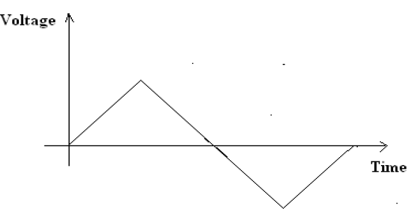

## Theory

#### CATHODE RAY OSCILLOSCOPE (CRO)

The cathode-ray oscilloscope (CRO) is a common laboratory instrument that provides time and amplitude measurements of voltage signals over a wide range of frequencies. The CRO is a cathode-ray tube shown schematically in Figure 1.

Figure 1

The cathode ray is a beam of electrons which are emitted by the heated cathode (negative electrode) and accelerated toward the fluorescent screen. The assembly of the cathode, intensity grid, focus grid, and accelerating anode (positive electrode) is called an electron gun. Its purpose is to generate the electron beam and control its intensity and focus. Between the electron gun and the fluorescent screen are two pair of metal plates - one oriented to provide horizontal deflection of the beam and one pair oriented ot give vertical deflection to the beam. These plates are thus referred to as the horizontal and vertical deflection plates. The combination of these two deflections allows the beam to reach any portion of the fluorescent screen. Wherever the electron beam hits the screen, the phosphor is excited and light is emitted from that point. This conversion of electron energy into light allows us to write with points or lines of light on an otherwise darkened screen. In the most common use of the oscilloscope the signal to be studied is first amplified and then applied to the vertical (deflection) plates to deflect the beam vertically and at the same time a voltage that increases linearly with time is applied to the horizontal (deflection) plates thus causing the beam to be deflected horizontally at a uniform (constant) rate. The signal applied to the vertical plates is thus displayed on the screen as a function of time. The horizontal axis serves as a uniform time scale.

A dual trace oscilloscope can display two traces on the screen, allowing us to easily compare the input and output waveforms. In this experiment, channel 1 is connected to function generator 1 and channel 2 is connected to function generator 2.

#### Obtaining a clear and stable trace

Once if we connect the oscilloscope to the circuit, it is necessary to adjust the controls to obtain a clear and stable trace on the screen in order to test it. In this experment, the input is given through two function generator.
- The Y AMPLIFIER (VOLTS/CM) control determines the height of the trace. Choose a setting so the trace occupies at least half the screen height, but does not disappear off the screen.
- The TIMEBASE (TIME/CM) control determines the rate at which the dot sweeps across the screen. Choose a setting so the trace shows at least one cycle of the signal across the screen. Note that a steady DC input signal gives a horizontal line trace for which the time base setting is not critical.
- The TRIGGER control is usually best left set to AUTO.

#### Measuring voltage and time period

The trace on an oscilloscope screen is a graph of voltage against time. The wavegorm of this graph is determined by the nature of the input signal. In addition to the properties labeled on the graph, there is frequency which is the number of cycles per second. The diagram shows a sine wave but these properties apply to any signal with a constant shape.

Figure 2

- Amplitude is the maximum voltage reached by the signal. It is measured in volts.
- Peak voltage is another name for amplitude.
- Peak-peak voltage is twice the peak voltage (amplitude). When reading an oscilloscope trace it is usual to measure peak-peak voltage.
- Time period is the time taken for the signal to complete one cycle. It is measured in seconds (s), but time periods tend to be short so milliseconds (ms) and microseconds (μs) are often used. 1ms = 0.001s and 1μs = 0.000001s.
- Frequency is the number of cycles per second. It is measured in hertz (Hz), but frequencies tend to be high so kilohertz (kHz) and megahertz (MHz) are often used. 1kHz = 1000Hz and 1MHz = 1000000Hz.

$$ Frequency=\frac{1}{Timeperiod} $$
 
$$ Timeperiod=\frac{1}{Frequency} $$

**Voltage:** Voltage is shown on the vertical y-axis and the scale is determined by the Y AMPLIFIER (VOLTS/Div) control. Usually peak-peak voltage is measured because it can be read correctly even if the position of 0V is not known. The amplitude is half the peak-peak voltage.
$$ Voltage=distanceinDiv× \frac{volts}{Div} $$

**Time period:** Time is shown on the horizontal x-axis and the scale is determined by the TIMEBASE (TIME/Div) control. The time period (often just called period) is the time for one cycle of the signal. The frequency is the number of cycles per second, frequency = 1/time period.
$$ Time=distanceinDiv× \frac{time}{Div} $$

#### Lissajous Figure

The oscilloscope used to display the time-varying input signal to channel 1 or channel 2. The oscilloscope displayed the information so that the value of the signal voltage was traced along the vertical while the oscilloscope traced a uniform time axis along the horizontal. However, it is useful to control the horizontal signal with an external source using the oscilloscope in the xy mode. This mode is generates Lissajous figures – these are figures created by connecting channel 1 to a function generator outputting a sine wave and channel 2 to a different sinusoid - hence the need for sharing functions generators. By letting channel 1 drive the horizontal and channel 2 the vertical, a shape will be traced out on the scope’s display.  
However, the phase of the signal generator outputs is fixed, though it often drifts slowly with time. On an oscilloscope, suppose x is channel 1 and y is channel 2, A is the amplitude of channel 1 and B is the amplitude of channel 2, a is the frequency of channel 1 and b is the frequency of channel 2, so ab
 is the ratio of frequencies of the two channels, and δ
 is the phase shift of CH1.  
The following figure shows some of the possible curves that can be drawn by varying the frequency and phase of the sinusoidal functions.

Figure 3

**Practical application** Lissajous curves can also be generated using an oscilloscope. An octopus circuit can be used to demonstrate the waveform images on an oscilloscope. Two phase-shifted sinusoid inputs are applied to the oscilloscope in X-Y mode and the phase relationship between the signals is presented as a Lissajous figures in figure 4.

Figure 4

#### Function Generator

A function generator is a device that can produce various patterns of voltage at a variety of frequencies and amplitudes. It is used to test the response of circuits to common input signals. The electrical leads from the device are attached to the ground and signal input terminals of the device under test.

#### Features and controls
1. Most function generators allow the user to choose the shape of the output from a small number of options.
- **Square wave** - The signal goes directly from high to low voltage.

Figure 4

- **Sine wave** - The signal curves like a sinusoid from high to low voltage.

Figure 4

- **Triangle wave** - The signal goes from high to low voltage at a fixed rate.

Figure 4

2. The amplitude control on a function generator varies the voltage difference between the high and low voltage of the output signal.
3. The direct current (DC) offset control on a function generator varies the average voltage of a signal relative to the ground.
4. The frequency control of a function generator controls the rate at which output signal oscillates. On some function generators, the frequency control is a combination of different controls.
5. One set of controls chooses the broad frequency range (order of magnitude) and the other selects the precise frequency. This allows the function generator to handle the enormous variation in frequency scale needed for signals.

#### How to use a function generator?

- After powering on the function generator, the output signal needs to be configured to the desired shape. Typically, this means connecting the signal and ground leads to an oscilloscope to check the controls.
- Adjust the function generator until the output signal is correct, then attach the signal and ground leads from the function generator to the input and ground of the device under test.
- For some applications, the negative lead of the function generator should attach to a negative input of the device, but usually attaching to ground is sufficient.

